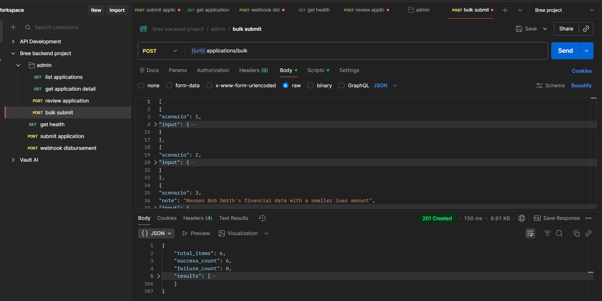

# AI Powered Loan Application Processor - Backend system

Backend implementation for loan scoring, strict state management, disbursement orchestration, webhook handling, admin review, duplicate prevention, and idempotency.

## Overview

This service implements the 4 hard requirements:

1. Scoring engine with config-driven weights and thresholds.
2. Enforced application state machine (including `partially_approved` migration support).
3. Disbursement webhook flow with retries and timeout escalation.
4. Prevention of duplicate application submission and webhook idempotency tracked on transaction id and application status.

## Tech Stack

- Python
- FastAPI
- SQLAlchemy
- SQLite
- Pydantic
- PyYAML

## Configuration

All core scoring/disbursement rules are in `config.yaml`:

- scoring weights
- decision thresholds
- income tolerance
- disbursement timeout and retry settings
- duplicate submission window
- database URL
- admin credentials

Default values:

- `auto_approve: 75`
- `manual_review: 50`
- `income_tolerance: 0.10`
- `retry_attempts: 3`
- `webhook_timeout_seconds: 120`
- `duplicate_window_minutes: 5`

## Project Structure

```
AI-Powered-Loan-Application-Processor-Backend/
│
├── app/
│   │
│   ├── __init__.py
│   ├── main.py
│   ├── config.py
│   ├── database.py
│   │
│   ├── models/
│   │   ├── __init__.py
│   │   ├── application.py
│   │   ├── score_breakdown.py
│   │   ├── audit.py
│   │   └── disbursement_event.py
│   │
│   ├── schemas/
│   │   ├── __init__.py
│   │   ├── application_schema.py
│   │   └── webhook_schema.py
│   │
│   ├── services/
│   │   ├── __init__.py
│   │   ├── score_engine.py
│   │   ├── state_machine.py
│   │   ├── duplicate_service.py
│   │   └── disbursement_service.py
│   │
│   ├── routes/
│   │   ├── __init__.py
│   │   ├── application_routes.py
│   │   ├── admin_routes.py
│   │   └── webhook_routes.py
│   │
│   └── errors/
│       ├── __init__.py
│       └── custom_errors.py
│
├── scripts/
│   └── simulate_disbursement.py
│
├── config.yaml
├── requirements.txt
└── README.md
```

## Setup

From project root:

```bash
python -m venv .venv
source .venv/Scripts/activate
pip install -r requirements.txt
```

Run API:

```bash
uvicorn app.main:app --reload
```

Swagger UI:

- `http://127.0.0.1:8000/docs`

## Implemented APIs

### Public

- `POST /applications`
- `POST /applications/bulk`

### Admin (Basic Auth)

- `GET /admin/applications?status=flagged_for_review`
- `GET /admin/applications/{application_id}`
- `POST /admin/applications/{application_id}/review`

### Webhook

- `POST /webhook/disbursement`

## Scoring Engine Details

Implemented in `app/services/score_engine.py`.

Factors and weights:

- Income Verification: 30
- Income Level: 25
- Account Stability: 20
- Employment Status: 15
- Debt-to-Income proxy: 10

Decision thresholds:

- score >= 75: auto-approve
- 50 <= score <= 74.99: flagged for review
- score < 50: auto-deny

### Income Tolerance Ambiguity

Interpretation used: symmetric tolerance around stated income.

```
abs(documented_income - stated_income) <= income_tolerance * stated_income
```

With `income_tolerance = 0.10`, documented income must be within +/-10% of stated income.

Reasoning:

- Avoids directional bias and unfair rejection of applications.
- Handles normal reporting variance in either direction.
- Keeps behavior deterministic and easy to explain for real-world scenarios, where documented incomes vary due to external factors like tax deductions and variable pays.

### Loom Clarification for income tolerance ambiguity (00:40–01:20)

In the Loom, I verbally stated the income tolerance baseline was documented income instead of stated income.

Correct implementation:
- I use **stated income as the reference baseline**.
- Income verification passes when:
  `abs(documented_monthly_income - stated_monthly_income) <= (income_tolerance * stated_monthly_income)`

With `income_tolerance = 0.10`, documented income must be within +/-10% of stated income.

## Application State Machine

Implemented in `app/services/state_machine.py` and enforced at runtime by calling `transition(...)` in routes/services.

Core path:

`submitted -> processing -> approved | denied | flagged_for_review`

Disbursement path:

`approved/partially_approved -> disbursement_queued -> disbursed | disbursement_failed`

Retry path:

`disbursement_failed -> disbursement_queued`

Escalation path:

`disbursement_queued/disbursement_failed -> flagged_for_review`

### Mid-Spec Migration: partially_approved

Added without breaking existing flows:

- `flagged_for_review -> partially_approved`
- `partially_approved -> disbursement_queued`

Admin review endpoint supports `partially_approve` with `reduced_loan_amount` persisted in `approved_amount`.

## Webhook retries and Idempotency for Audit trail

Implemented in `app/services/disbursement_service.py`.

Rules:

- Webhook `success` -> `disbursed`
- Webhook `failed` -> `disbursement_failed`, then retry queue (up to configured max - 3)
- Retry limit reached -> `flagged_for_review`
- Same `transaction_id` replay -> no-op (idempotent)
- Already `disbursed` + new webhook -> no-op (safe guard)
- Timeout for queued disbursement -> escalates to `flagged_for_review`

Conflict reconciliation (idempotency vs unique retry audit):

- `transaction_id` is idempotency key for provider webhook event replay.
- `retry_id` is unique per retry attempt in `audit_events`.
- **Result:** replay safety + complete retry audit history.

## Duplicate Prevention

Implemented in `app/services/duplicate_service.py`.

Rule:

- same `email + loan_amount` within `duplicate_window_minutes` (default 5) -> reject with `DuplicateApplicationError`
- response includes original/existing application id in error details

## Typed Errors

Implemented in `app/errors/custom_errors.py`:

- `InvalidStateTransitionError`
- `DuplicateApplicationError`
- `WebhookReplayError`

## Webhook Simulator

Script: `scripts/simulate_disbursement.py`

Examples:

```bash
python scripts/simulate_disbursement.py --application-id <APP_ID> --scenario success
python scripts/simulate_disbursement.py --application-id <APP_ID> --scenario failed
python scripts/simulate_disbursement.py --application-id <APP_ID> --scenario replay
python scripts/simulate_disbursement.py --application-id <APP_ID> --scenario all
```

Optional flags:

- `--base-url http://127.0.0.1:8000`
- `--transaction-id <TXN_ID>`

## Explanations covered in Loom video:

Loom Video link: https://www.loom.com/share/0861b294832644659b0e5bacebeb957f

### Happy path

1. Submit application (`POST /applications`) that auto-approves.
2. Show status is `disbursement_queued`.
3. Trigger simulator success webhook.
4. Show final status `disbursed`.

### Failure paths

1. Webhook `failed` events with different transaction IDs.
2. Show retries + audit trail (`retry_id` per retry) in DB.
3. Show escalation to `flagged_for_review` when retries exhaust.
4. Show invalid transition rejection (`denied -> processing`).

### Idempotency

1. Submit duplicate application within 5 minutes -> duplicate error.
2. Replay same webhook transaction ID -> no-op replay-safe response.
3. Replay same webhook with different transaction ID for 'Disbursed' status -> no-op replay-safe response.

## Additional Scenarios not covered in the Loom Explanation:

1. ### Verification of 'partial_approval' flow from admin point of view:

API: `POST /admin/applications/{application_id}/review`

Original requested loan amount: 3000

**Negative flow:**

*Request Payload:*

```
{
  "decision": "partially_approve",
  "note": "The loan is approved for this application",
  "reduced_loan_amount": 3500
}
```

*Response:*
```
{
    "detail": "reduced_loan_amount cannot exceed loan_amount."
}
```
**Positive Flow:**

*Request Payload:*

```
{
  "decision": "partially_approve",
  "note": "The loan is approved for this application",
  "reduced_loan_amount": 2500
}
```

*Response (trimmed):*
```
{
  "...": "...",
  "status": "disbursement_queued",
  "final_decision": "partially_approve",
  "admin_review_note": "The loan is approved for this application"
}
```

2. ### Bulk upload of payloads and test scenarios given in the assignment:

In Loom explanation, I have shown the API endpoints that accept single JSON. For testing purpose, I have created another endpoint as given in the test scenario so that bulk upload of applications can be done via this endpoint:

`POST /applications/bulk`

**Trimmed screenshot from Postman:** Expected and actual test scenarios are passed.


